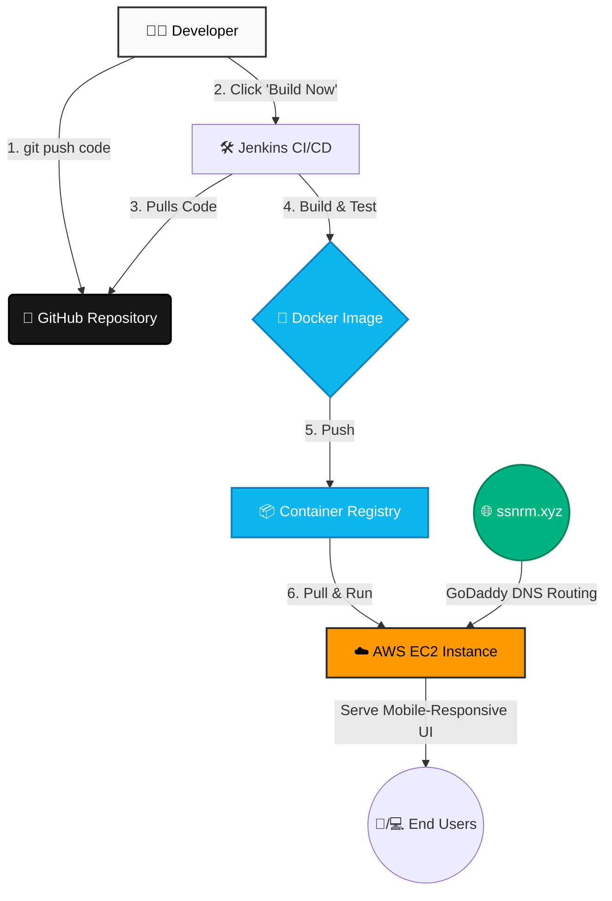

# 🍽️ Automated Restaurant Management Deployment (ssnrm.xyz)

A fully mobile-responsive, containerized Django web application deployed to AWS EC2 using an automated CI/CD pipeline built with Jenkins and Docker. The application is served via a custom GoDaddy domain (`ssnrm.xyz`).

This project was developed with an **infrastructure-first mindset**. The application logic was accelerated using AI-assisted code generation, allowing the primary engineering focus to remain on cloud architecture, domain name configuration, containerization, and deployment automation.

🌐 **Live Domain:** [ssnrm.xyz](http://ssnrm.xyz) *(Note: To maintain a zero-cost AWS footprint, the EC2 instance may be temporarily stopped).*

## 🏗️ Pipeline & Infrastructure Architecture

The delivery lifecycle is fully automated. Code pushes trigger Jenkins to build a new Docker image, which is then deployed to an AWS EC2 instance. Traffic is routed to the instance via GoDaddy DNS.

🚀 Key Features

Automated CI/CD: A Jenkins pipeline is configured to automatically build and deploy the application immediately upon new repository commits.
Custom Domain & DNS: Integrated a GoDaddy domain (ssnrm.xyz), mapping DNS records to the AWS EC2 Elastic IP for standard web routing.
Mobile Responsiveness: The UI is designed to be fully responsive, ensuring a seamless experience for restaurant staff using mobile devices, tablets, or desktop terminals.
Consistent Environments: Dockerized application architecture ensures exact parity across development, testing, and production environments.
Cost-Optimized Cloud Infrastructure: Deployed on AWS EC2, strictly utilizing free-tier limits to maintain a zero-cost cloud footprint through optimized instance lifecycle management.
Design Patterns: The underlying Python application leverages structural and behavioral design patterns (Facade, Observer, Strategy, Factory, Singleton, Decorator) for high maintainability.

🛠️ Technologies Used

Infrastructure & DevOps: Docker, Jenkins, AWS EC2, Git/GitHub
Networking: GoDaddy (DNS Management)
Backend: Python, Django
Frontend: HTML, CSS (Django Templates), Mobile-First Responsive Design
Database: SQLite (Development)

💻 Local Setup & Execution

To run this project locally, ensure you have Docker installed.
Clone the repository:
git clone [https://github.com/yourusername/restaurant-management-system.git](https://github.com/yourusername/restaurant-management-system.git)cd restaurant-management-system

Build and run using Docker:

docker build -t restaurant-app .
docker run -p 8000:8000 restaurant-app

Access the application:

Open your browser and navigate to http://localhost:8000
    class D,E docker;
    class B github;
    class H dns;
